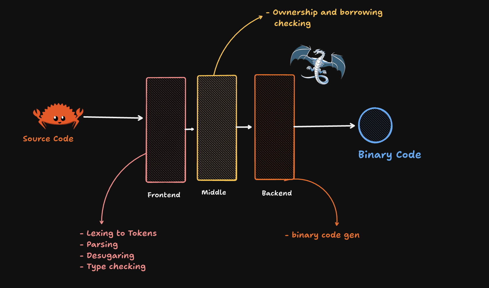
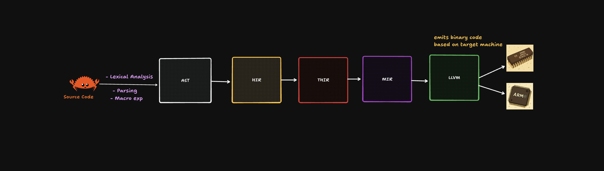

# 🍊 Rust Compiler For Dummies


## Setting Up the Stage: 
As you may already know, all programs that are written are ultimately converted into binary instructions (those fancy zeros and ones). Why? Because the CPU cannot understand our source code, all it understands is 0s and 1s. Since we cannot write or interact with the memory by writing 0s and 1s, we have to create some abstraction for writing programs in a human readable fashion.

The thinnest abstraction layer for writing code to interact with memory is **Assembly**. It is a low-level language that helps us write human readable code, operates directly with memory, and provides fine-grained control over computer operations.
Although Assembly offers high efficiency and speed, it is not commonly used because it is more prone to memory issues and the complexity of writing code. So then how can we interact with memory safely?

The second level of abstraction provides us with **high-level programming languages** (like Rust, C, and Go). These languages are more human readable than assembly language, featuring syntactic sugar that hides much of the complexity and memory management from the programmer. With this, programmers can write programs with less complexity and fewer errors. Different languages handle memory allocation and deallocation in various ways, some manage it efficiently, while others do not, each with its own trade-offs. But wait a sec... haven't I just told you the CPU cannot understand anything other than 0s and 1s (binary)?

We cannot execute high-level programming language programs directly on the CPU, we must convert these syntactic sugar programs into binary code. This translation is done by **compilers**. We will focus on how Rust code is converted to binary code and what internal checks occur during compilation. We will peel layer by layer and understand each and every stage. With this in mind, let's get started 😄.

## High-Level Overview of Compilation Layers
The code written by developers is human-readable, allowing others to easily read and understand it. However, a compiler cannot understand human-written code. We need to convert source code into binary code, which is the only format the CPU can understand.


Although there are several steps required to produce binary code, at a high level, these steps are divided into three main pillars: **Frontend, Middle, and Backend**. This breaks down the complex process of converting source code to machine code.


<br/>

At the frontend, you have Rust code. At the backend, you have the binary machine code generated by **LLVM (Low Level Virtual Machine)** that runs directly on the target machine. In the middle, all the Rust-specific ownership and borrowing checks happen.

We will peel back each layer and understand how Rust compilation works. If we zoom in a little on the Rust compilation three pillars, this is what we get as you can see in the image below.


<br/>

I don't expect you to know all the terms shown in the picture above, but don't worry—by the end of this blog, you will understand all of them. Let's go step by step, peeling back each layer to understand what happens while compiling our code.

Keeping this big picture in mind, let's start peeling the Orange 🍊.

### Layer One: Lexing, Parsing, and AST:

Let's take an example as source code:
```rust
fn main() {
    // Let's do some investigation :)
    let some = String::from("chinna");
    println!("Say my name:");
    println!("{}", some);

    time_pass(&some);
}

fn time_pass(pass: &String) {
    println!("Time passing with this guy: {}", pass);
}
```

This step is the first one where compilation starts. The compiler first reads the `.rs` file as plain text, then breaks down this linear text into **Tokens** like `fn`, `some`, `{`—this is called **Lexing**.

Then the compiler converts these tokens into a tree-like structure called AST (Abstract Syntax Tree), and this AST still resembles the source code a lot, but it is in a tree-like structure. This is known as **Parsing**. You can see the AST version of the code example that we have taken [here](https://github.com/baindlapranayraj/rektoff/blob/main/rektoff-office-hour/AST.txt). Due to this, all the macros get expanded in this layer.


The AST captures all the syntactic code into a tree-like structure. You may ask, why do we need to do this? 

Well, compilers cannot understand this linear source code directly. The source code is sugar-coated syntax designed for human readability, not for compilers. The Abstract Syntax Tree (AST) abstracts away certain details, it is a tree data structure that best represents the syntactic structure of the source code. You can learn more about AST on this [Wikipedia page](https://en.wikipedia.org/wiki/Abstract_syntax_tree).


### Layer Two: AST Lowering (HIR and THIR): 
Well, after parsing the tokens and converting them into an AST, the next layer begins. At this point, the AST closely resembles the source code, which still contains a lot of syntactic sugar, such as `for` and `match`.

We need to peel away this syntactic sugar to simplify the AST. The result of this desugaring process is a form of the AST known as **HIR (High-Level Intermediate Representation)**. HIR is still close to what the user originally wrote, but it removes syntactic sugar for example, converting a `for` loop into a `loop` with iteration logic. After removing all the fluff, HIR is now a more compiler-friendly abstraction representation of the AST.

This process of simplifying or transforming the AST by removing syntactic sugar is known as **lowering**, and by the way, you can check the HIR representation of the AST by running this command: `rustc +nightly -Z unpretty=hir-tree src/main.rs`.

By lowering the HIR further down and checking whether all types of the code are used correctly or not, like for example you cannot add an integer with a string, and of course you can do shit like this in JavaScript 🤡.


