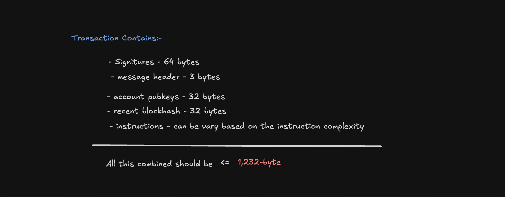
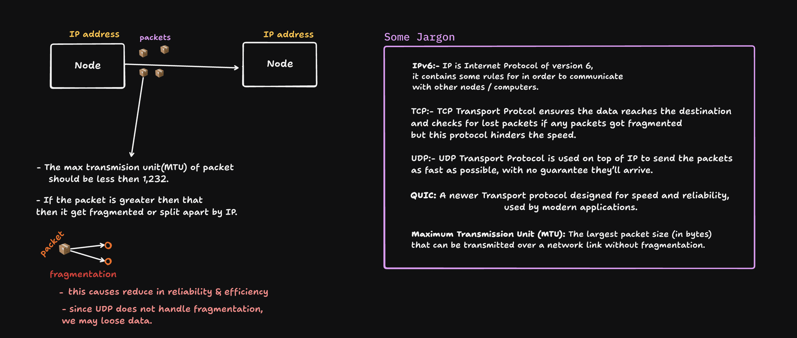

# 🦀 Solana Limitatons (Still writing)

GM GM everyone 😁,

In this blog, we will go through the various types of Solana resource limitations you might encounter while developing smart contracts. You may run into errors containing words like "limit" or "exceed." These errors represent boundaries predefined by Solana programs to maintain fairness and performance on the blockchain. If you’d like to get more information on these topics, you’re in the right place!

Hear what u can expect from this blog:-

- CU Limitations
- Transaction size limitations
- Stack size


# Limitations of Solana:

Solana is a high-performance public blockchain that stands apart from traditional blockchains like Bitcoin and Ethereum due its unique approach to transaction processing separates logic and state into different accounts, which allows Solana to process many transactions simultaneously.

However, programs running on Solana are subject to several types of resource limitations. These limitations ensure that programs use system resources fairly while maintaining high performance.

Knowing these boundaries is very helpful for developers, as it guides them in building efficient and reliable program.

## 1. Compute Unite Limitations:

### What is Compute Units ?

CU (Compute Unit) the name itself suggests that CU is the fundamental measurement of the computational work (CPU cycles and memory usage) performed by a transaction or instruction on Solana. It's similar to "Gas" fees in Ethereum but is much more predictable and low-latency.

Every instruction your smart contract executes on-chain, such as reading or writing to accounts, performing cryptographic operations (like zk-ElGamal), or verifying signatures and serailization and deserialization consumes a certain number of compute units (CUs). This is roughly proportional to the amount of work done by the nodes.

If you perform simple transactions, then nodes can process those smart contracts efficiently, resulting in lower CU consumption. However, if you perform complicated mathematical operations or heavy loops, nodes consume a large amount of memory and CPU, and it takes more time to run the program (smart contract), resulting in higher CU consumption

_For example, for an simple transaction like sending a SOL form wallet A to wallet B it takes around 3000 Compute Units_

```rust

let transfer_amount_accounts = Transfer {
      from: ctx.accounts.signer.to_account_info(),
      to: ctx.accounts.recipient.to_account_info(),
    };

let ctx = CpiContext::new(
        ctx.accounts.system_program.to_account_info(),
        transfer_amount_accounts,
      );

transfer(ctx, amount * LAMPORTS_PER_SOL)?;

 // Takes around 3000 CU
```

The code in the above was written in Anchor ⚓️, It performs an simple transfer of SOL, and for that it taking 3000 CUs.

### Compute Unit Budget

- As we know, heavy mathematical operations or loops consume a large amount of compute units. However, there is a default budget of 200,000 CUs for every transaction or instruction.

- If a transaction or instruction exhausts the 200,000 CU limit, the transaction or instruction is simply reverted, all state changes are undone, and the fees are not refunded to the signer who invoked the transaction. (This mechanism prevents attackers from running never-ending or computationally intensive programs on nodes, which could slow down or halt the chain.)

```rust
Error: exceeded maximum number of instructions allowed (200000) compute units
```

- Personally, I encountered this error while building my Chaubet project. When a bettor buys shares,[this function](https://github.com/baindlapranayraj/Chaubet/blob/86b5c91de727dd173a0593a7378a0acb3eb25b2a/programs/chaubet/src/utils/helper.rs#L89C5-L132C6) performs some heavy mathematical computations and checks. Due to this, the instruction exceeded the 200,000 CU limit, and the entire instruction was reverted.

- Well we can increase our computation limit using `SetComputeUnitLimit` we can request a specific calculation unit limit by adding an instruction to our transaction. But 🍑 we can only increase CUs Budget only upto 1.4 Million Units.

```rust
const computeLimitIx = ComputeBudgetProgram.setComputeUnitLimit({
  units: 500000,  // Increased from 200k to 500k CUs.
});
```

- Regardless of the compute units consumed, the transaction charged 5000 lamports or 0.000005 SOL.

### Why we have limited Compute Unit Budget ?

In short and simple terms, Solana has CU limitations to ensure fair resource allocation. But what does that mean ?

Solana validators are individual computers (or nodes) that process blockchain transactions and maintain the network’s state (these are the basic fundamentals you must know 😒). Each validator has limited CPU power and memory, just like any regular computer. When programs run inside these nodes, they allocate some memory to process all the instructions.

Now, if a malicious user sends a transaction that contains infinite loops, it can use a huge amount of memory and may slow or even crash the system. Since the blockchain is a network of shared computers/nodes, if one user performs a huge number of CPU tasks and uses a large amount of CPU/memory, it hogs the system, starving other users.

Due to this limitation in CU Budget it helps solana network to prevent denial-of-service (DoS) attacks and resource exhaustion on validators.

## 2. Transaction Size Limit.

Before getting into Transaction Size Limit, lets peak a little into what are transactions what do they contain.
A transaction on Solana is a request sent by users to interact with the network, typically to mutate data such as transferring lamports (the native token unit) between accounts.

Each transaction contains one or more instructions that specify the operations to perform on the blockchain. This execution logic is stored in raw bytes in program state.


### The Transaction Contains:

- **Array of signatures**:- A sequence of signatures included in the transaction.
- **Message**:- This is the core part of the transaction. It contains everything needed to describe what the transaction intends to do.

  As you are already seeing the above Image, The Message is the core part of the transaction which contains the :-

- Header:- This one indicates the number of signers and read-only accounts **(3 bytes)**
- Array of Accounts:- It contains all the accounts required to perfrom the transaction, provided from the client (Each Pubkey 32 bytes)
- Recent Blockhash:- A recent blockhash was attached to this transaction (32 bytes)
- Array of Instruction:- Contains all instructions invoked by the signer(The size is depended on complexity of Instruction code).

### Transacion Size Limitaions:-



Every Solana transaction has a size limit of **1,232 bytes**. The total transaction size is the sum of the bytes for all signatures, accounts involved, the blockhash, and the instructions (including their accounts and data), and must be less than 1,232 bytes. Because of this limit, developers need to fit all signers, account addresses, and required data within the 1,232-byte constraint

You would have encounter the `transaction size limit exceeded` error when you try to send too many accounts from client side or too many instructions in single transaction.


**you might wonder why only limited to 1,232 bytes ?**
In short :- The transaction size limit of 1,232 bytes in Solana is closely tied to how data is transmitted over the internet using IPv6 (Internet Protocol version 6). But lets break it down more.

**Hears Why ?:**

- explain QUIC (what and why)
- explain the Trx size limit and new update on it.

#### Let’s go back to some fundamentals of computer networking briefly.

So, what is computer networking?

In simple terms, it's a group of computers or nodes connected together to share data 📦 among them. This can involve communication between two local nodes/computers (LAN) or between computers across the globe (Internet).

For In order to communicate with nodes effectively without sending data 📦 or information to the wrong destination node, we need a set of rules or protocols to follow. **IP (Internet Protocol)** is the universal addressing system for nodes on a network. IP provides unique address for every node or computer and uses these addresses to route and deliver data packets 📦 to the correct destination.

But solana also uses UDP(User Datagram Protocol) on top of IP, to send the packets/data 📦 more quickly (unlike in etheareum uses TCP which do lots of checks and hinders the speed if packet is too large). UDP just fires packets 📦, as fast as possible, with no guarantee they’ll arrive. But 🍑 if packet is large(if greater then MTU) then might get fragmented(splitted) which we may loose some data which reduces the reliablity.



OK now why are we learning all these stuff ? how are they related to Transaction Size limit ?
 Hold your horses we are getting there lets connet some dots 😌.

Solana nodes, like other networked computers, communicate using the Internet Protocol (IP)—often IPv6, the latest version. They must follow IP's rules for addressing and routing data. Solana nodes send serialized transactions to each other using the UDP transport protocol, which is fast and efficient.

However, if a transaction (UDP packet) is larger than the network’s Maximum Transmission Unit (MTU), it is fragmented (split) by the IP layer, not by UDP itself. UDP simply sends the packets—it does not handle fragmentation If any fragment is lost in transit, the entire transaction is lost, since UDP provides no error correction or retransmission.

So this fragmentation is handled by Solana,In order to avoid fragmentation the packt/transaction size should be less then MTU(Maximum Transmission Unit) which is typically **1280 bytes**.After Removing the headers(IP and UDP header = 48 bytes), 
the remaining 1,232 bytes are allocated for transaction size.

 
## 3. Stack Size Limitations

In Solana programs (smart contracts), there's a limitation on the stack size - the amount of memory allocated for local variables and function calls. The current stack frame size limit is **4KB per frame**.

### What is Stack Memory?

Stack memory is used for:

- Local variables in functions
- Function parameters
- Return addresses
- Temporary data

### Stack Size Constraints

```rust
pub fn process_instruction(
    program_id: &Pubkey,
    accounts: &[AccountInfo],
    instruction_data: &[u8],
) -> ProgramResult {
    // This large array on stack might cause issues
    let big_array = [0u8; 4096]; // ❌ This would fail

    // Better to use smaller arrays or heap allocation
    let small_array = [0u8; 1000]; // ✅ This is fine
    Ok(())
}
```

To work around stack limitations:

1. Use heap allocation when necessary
2. Break large functions into smaller ones
3. Avoid large stack-allocated arrays
4. Use references instead of moving large data structures


[solana_optimization_github](https://github.com/solana-developers/cu_optimizations) <br/>
[rare_skill_blog_post](https://www.rareskills.io/post/solana-compute-unit-price) <br/>
[solana github discussion SIMD-0296](https://github.com/solana-foundation/solana-improvement-documents/pull/296/commits/bbc29c909085589989ca5f258550ce4447e68a89)<br/>
